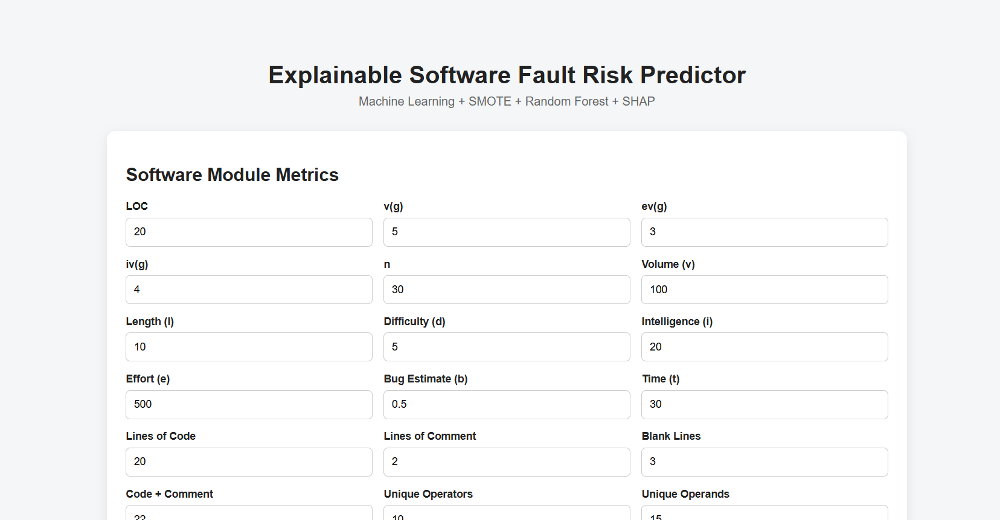
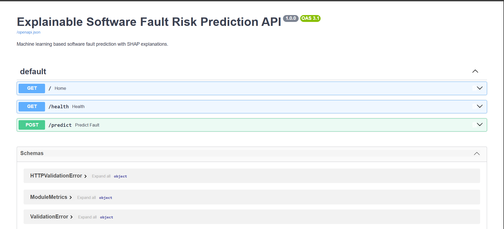
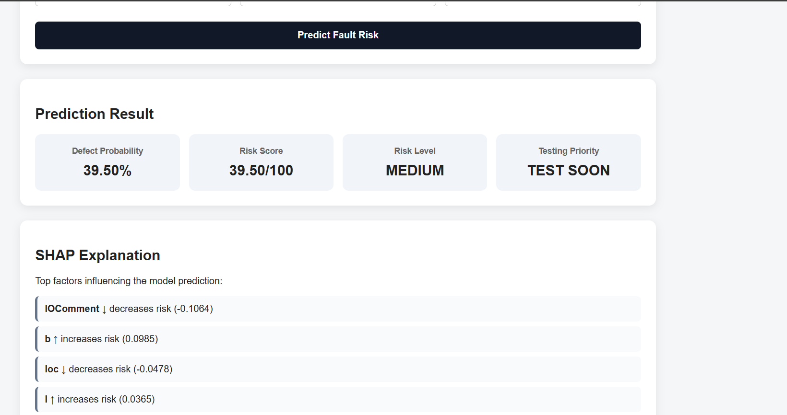

# Explainable Cross-Project Software Fault Prediction and Risk-Based Testing

An Explainable AI-based software fault prediction system that predicts module-level defect risk, explains predictions using SHAP, performs cross-project defect prediction, and prioritizes software testing based on risk.

## 🚀 Live Demo

👉 **[Open Live Demo](https://explainable-cross-project-software-fault.onrender.com/)**

> The free Render instance may take a short time to wake up after inactivity.

---

## 🖥️ Application Preview

### Software Fault Risk Predictor

The dashboard allows users to enter software module metrics and obtain defect-risk predictions.



### Prediction Result & SHAP Explanation

The system provides defect probability, risk score, risk level, testing priority, and SHAP-based explanations.



### FastAPI Swagger API

The REST API provides endpoints for health monitoring and software fault-risk prediction.



---

## 📌 Problem Statement

Modern software projects contain a large number of modules, making it difficult for development and testing teams to test every module with equal priority.

Software defects are often associated with characteristics such as code size, complexity, branching, operators, operands, comments, and other software metrics.

Traditional testing approaches may spend significant effort testing low-risk modules while fault-prone modules require greater attention.

This project proposes an Explainable AI-based framework that predicts software module defect risk, explains the predictions, and prioritizes testing activities.

The project also investigates **Cross-Project Defect Prediction (CPDP)** to determine whether a model trained on one software project can generalize to another project.

---

## 🎯 Objectives

The main objectives of the project are to:

- Analyze software metrics associated with software defects.
- Preprocess and clean software defect datasets.
- Compare multiple machine learning algorithms.
- Handle class imbalance using SMOTE.
- Optimize the classification threshold using validation data.
- Predict module-level defect probability.
- Generate a 0–100 risk score.
- Classify modules into LOW, MEDIUM, and HIGH risk.
- Prioritize software testing based on predicted risk.
- Explain predictions using SHAP.
- Evaluate Cross-Project Defect Prediction.
- Analyze explanation consistency across projects.
- Provide a FastAPI-based prediction API.
- Provide an interactive web dashboard.
- Containerize the application using Docker.
- Deploy the system using Render.

---

## 🔬 Research Questions

### RQ1
How effectively can the proposed approach predict defective software modules within a project?

### RQ2
How does the direction of Cross-Project Defect Prediction affect prediction performance?

### RQ3
How consistent are SHAP feature explanations across different cross-project prediction directions?

---

## 📊 Datasets

The experiments use software defect datasets from the NASA/PROMISE software defect dataset collection.

### Projects Used

- **CM1**
- **JM1**

The datasets contain software metrics related to:

- Lines of code
- Cyclomatic complexity
- Halstead metrics
- Operators and operands
- Branches
- Comments
- Code structure

The target variable represents whether a software module contains a defect.

---

## 🧹 Data Preprocessing

The preprocessing pipeline includes:

```text
Raw Dataset
     ↓
Remove ID
     ↓
Convert Defect Labels
     ↓
Handle Invalid Values
     ↓
Remove Duplicate Rows
     ↓
Prepare Features
     ↓
ML-Ready Dataset
